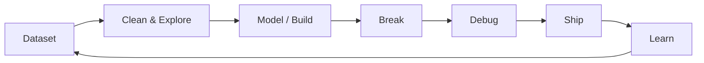

<h1 align="center">
  <a href="https://github.com/GYANESHWAR-techhub">
    
  </a>
</h1>

<p align="center">
  <a href="https://www.linkedin.com/in/gyaneshwar-m-654680281/">
    
  </a>
  <a href="mailto:jm394978@gmail.com">
    
  </a>
  
</p>

---

## ⚡ Developer Signal

```
gyaneshwar@github:~$ whoami

Name        : Gyaneshwar Mishra
Role        : Data Science Student · Full-Stack Developer
Studying    : B.Tech, Data Science — ABESIT Engineering College (2024–2028)
Speciality  : Python, ML fundamentals, full-stack web (React/Node/Django)
Current Mode: Interning, building, breaking things, fixing them again
Mindset     : Learn the pipeline end to end — data in, product out.
```

I'm a Data Science student who got here by way of full-stack web development —
I like knowing what happens on both sides of an API call: the model that produces
the number, and the interface that makes it usable.

---

## 🧭 Mission Control

| 🚀 I Build | 🧠 I Think Like |
|---|---|
| Full-stack web applications | First get it working |
| Data preprocessing & analysis pipelines | Then get it right |
| Predictive models (Pandas / NumPy / Scikit-learn) | Then get it clean |
| Automation scripts & backend flows | Then understand *why* it works |
| REST API integrations | Then ship it |

---

## 💼 Experience

| Role | Organization | When |
|---|---|---|
| Web Development Intern | Zidio Development | Apr 2026 – Jun 2026 |
| Python, Data Science & AI/ML Intern | ABESIT Institute of Technology | Jun 2026 – Jul 2026 |
| Python Development Intern | CodeAlpha | Apr 2026 – Jun 2026 |

- Built and customized full-stack apps with React, Node.js & MongoDB — UI, API integration, deployment
- Ran data preprocessing and predictive modelling projects with Pandas, NumPy & Scikit-learn
- Wrote Python automation scripts — data structures, file handling, APIs, OOP

---

## 🛠 Tech Constellation

<p align="center">
  
</p>

---

## 🧪 Current Build Profile

```yaml
developer:
  name: Gyaneshwar Mishra
  username: GYANESHWAR-techhub
  focus:
    - Applied machine learning on real-world datasets
    - Full-stack web apps (React / Node / Django)
    - Automation scripts and clean backend flows
    - Turning messy data into models that hold up
  favorite_stack:
    languages: [Python, C/C++, JavaScript]
    frontend: [React.js, HTML, CSS]
    backend: [Node.js, Express.js, Django]
    data: [Pandas, NumPy, Scikit-learn]
    database: [MongoDB, MySQL]
    deploy: [Vercel, Render]
  status: "Three internships in, degree in progress"
```

---

## 📊 GitHub Radar

<p align="center">
  
</p>

<p align="center">
  
  
</p>

### 🐍 Contribution Snake

<p align="center">
  
</p>

> This one needs a small GitHub Action to generate — see the setup note at the bottom.

---

## 📌 Featured Repositories

<p align="center">
  <a href="https://github.com/GYANESHWAR-techhub/Farmer-crop-prediction-">
    
  </a>
  <a href="https://github.com/GYANESHWAR-techhub/basic-code-collection">
    
  </a>
</p>

**Farmer Crop Prediction** — a web app that recommends the most suitable crop for a farm using data-driven prediction, aimed at helping farmers make smarter agricultural decisions.

---

## 🧬 Build Philosophy

- ⚡ **Working** — a model or an app that isn't running is just an idea.
- 🧠 **Understood** — I'd rather explain *why* it works than just that it does.
- 🎯 **Useful** — the goal is always a real answer to a real question.

---

## 🎮 Side Quests



- 🔬 Applying ML fundamentals to real-world datasets
- 🌐 Shipping full-stack apps end to end — frontend to deployment
- 🧰 Writing automation scripts to remove manual work
- 📚 Working through a Data Science degree while interning in parallel

---

## 🌐 Connect

<p align="center">
  <a href="https://www.linkedin.com/in/gyaneshwar-m-654680281/">
    
  </a>
</p>

<p align="center"><i>Thanks for stopping by — now go build something that actually works.</i></p>
